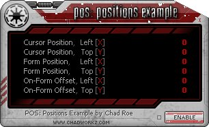



## POS: Cursor &amp; Form Positions &amp; Offsets \- Plus many more Subs &amp; Functions\!

### Description

[www.chadworkz.com] This is an example of how to get the cursor's X &amp; Y positions, the form's X &amp; Y positions, and the X &amp; Y offset between the two. All positions are dynamic and change as you move the cursor and/or the form. The offset values are very valuable, especially for true "mouse-over" functions. The offset is the difference between the cursor's position on the screen and the cursor's position on the form. Trust me, this is something that everyone needs to learn and know...it can be extremely valuable.
 
### More Info
 
There are a lot more Subs &amp; Functions in this example that you can learn from. Some may think they are just basic codes, but in reality, they are very good and sometimes complex codes that everyone needs to learn. Spend some time looking through this example and check out everything it has to offer!

Returns the cursor's X &amp; Y positions, the form's X &amp; Y positions, and the offset between the two. The offset is the difference between the cursor's position on the screen and the cursor's position on the form.

             |
---                |---
**Submitted On**   |2008-02-23 22:42:32
**By**             |[Chad Roe](https://github.com/Planet-Source-Code/PSCIndex/blob/master/ByAuthor/chad-roe.md)
**Level**          |Advanced
**User Rating**    |5.0 (10 globes from 2 users)
**Compatibility**  |VB 3\.0, VB 4\.0 \(16\-bit\), VB 4\.0 \(32\-bit\), VB 5\.0, VB 6\.0
**Category**       |[Miscellaneous](https://github.com/Planet-Source-Code/PSCIndex/blob/master/ByCategory/miscellaneous__1-1.md)
**World**          |[Visual Basic](https://github.com/Planet-Source-Code/PSCIndex/blob/master/ByWorld/visual-basic.md)
**Archive File**   |[POS\_\_Curso2103182242008\.zip](https://github.com/Planet-Source-Code/chad-roe-pos-cursor-amp-form-positions-amp-offsets-plus-many-more-subs-amp-functions__1-70138/archive/master.zip)

